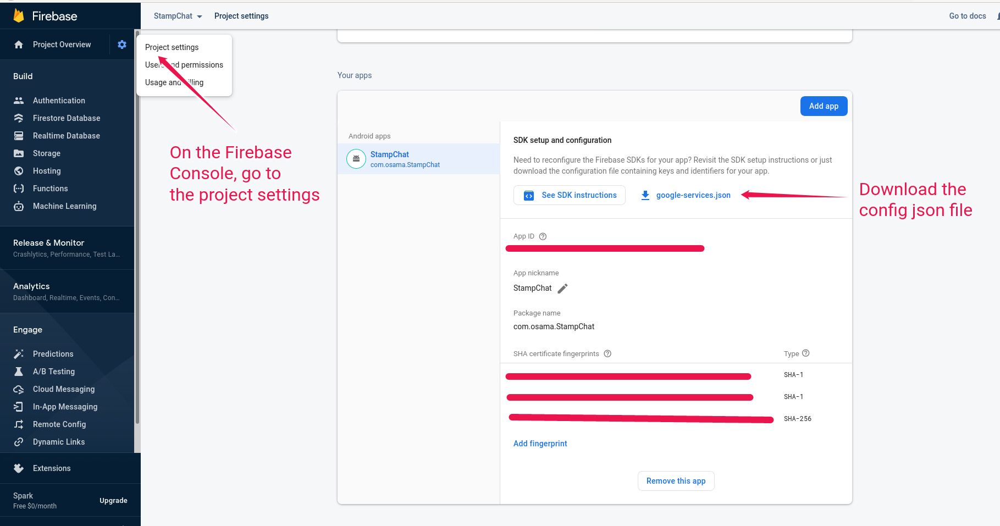

# StampChat Push Notification Server
StampChat is a mobile chat app. This repo contains one of the services backing that app. This service handles storing push notification tokens and sending push notifications.

# Project Overview

This service uses node and is written using the [KoaJS](https://koajs.com/) framework.

This service is part of a larger project. For a complete project overview see the:
* [StampChat infrastructure repo](https://github.com/OsamaElHariri/StampChat_Kubernetes)
* [StampChat mobile app repo](https://github.com/OsamaElHariri/StampChat_App)

# Setting up localhost Testing

To setup for localhost testing:

1. Get the dependacies
```sh
npm install
```

2. Make sure the database is running and that the DB connection string in `knexfile.js` is correct
3. Run the databse migrations
```sh
./node_modules/.bin/knex migrate:latest
```
4. Download your Firebase config file and place it in the project root. Rename it to `service_account.json`
<p align="center">
  
</p>

5. Run this server
```sh
node_modules/.bin/nodemon src/app.js
```

